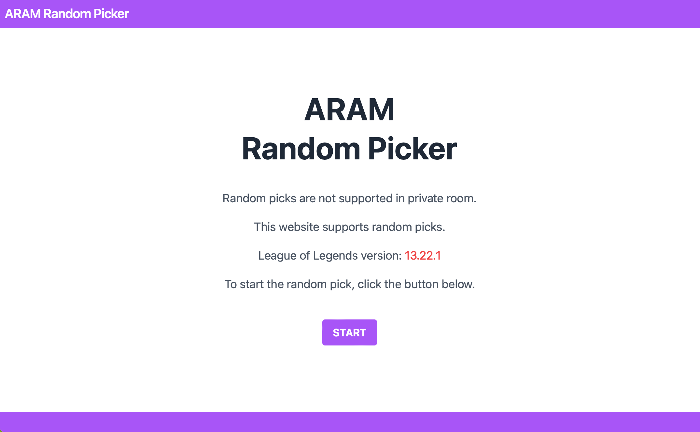
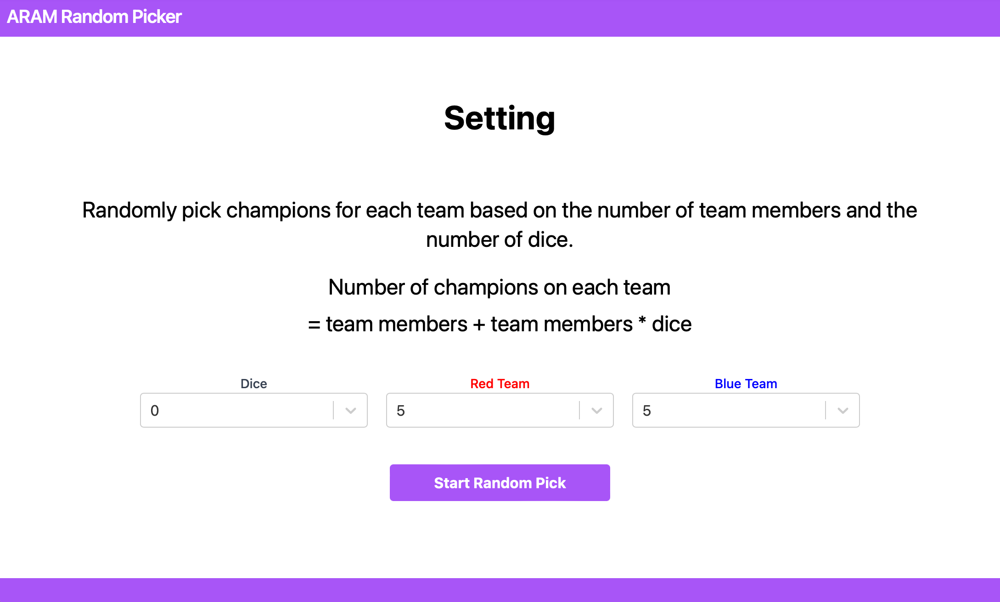
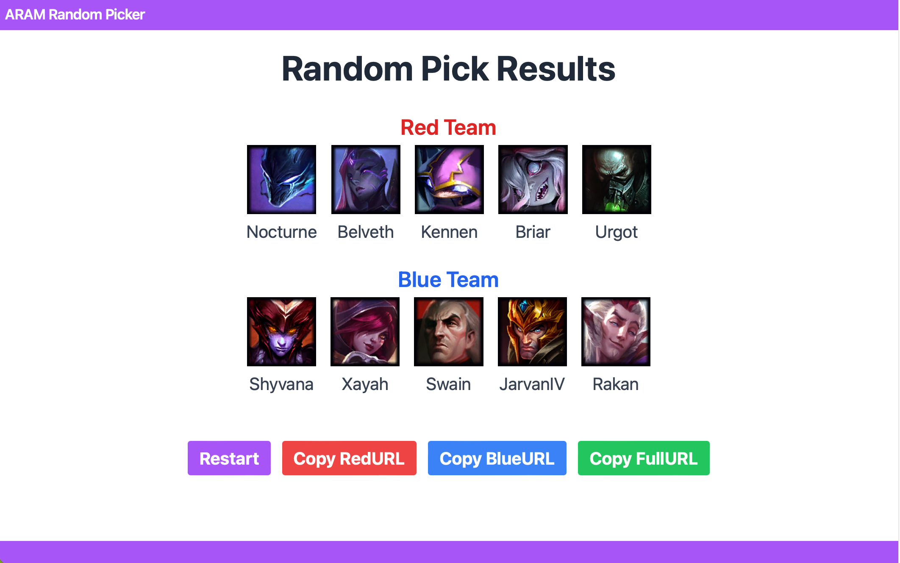
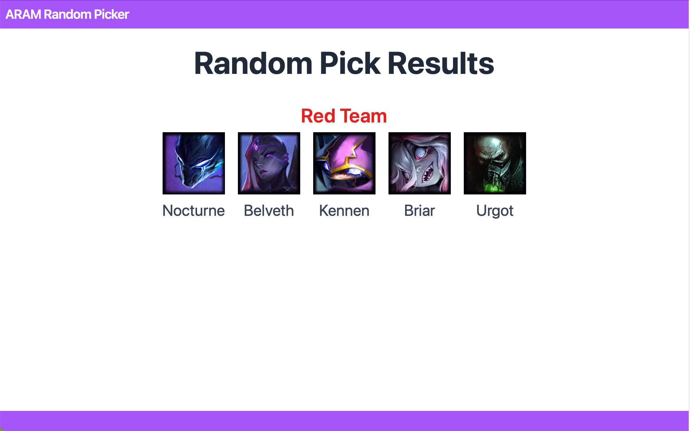

# ARAM Random Picker

리그오브레전드의 무작위총력전인 칼바람나락의 랜덤픽을 할 수 있습니다.  
사설방에서는 주사위와 랜덤픽을 지원하지 않습니다.  
이 웹사이트를 이용하면 주사위와 랜덤픽을 할 수 있습니다.

이 서비스가 궁금하시다면 [mealchoice](https://aram-random-picker.vercel.app)를 클릭하세요.

## 프로젝트 기간

2023-11-14 ~ 2023-12-6

## 기술 스택

## 서비스 화면

### 1. 메인 페이지

### 2. 설정 페이지

### 3. 결과 페이지

Copy RedURL이나 Copy BlueURL를 누르면 해당 팀에 대한 챔피언만 공유 할 수 있습니다.

## 개발 내용

### 1. 챔피언 명단 가져오기

`https://ddragon.leagueoflegends.com/cdn/${version}/data/ko_KR/champion.json`이 url으로 get요청을 보내면 리그오브레전드 챔피언 데이터를 받을 수 있다.

그 중에서 챔피언의 영어 이름(id)를 파싱하여 배열에 저장한다.

### 2. 챔피언 이미지 가져오기

`https://ddragon.leagueoflegends.com/cdn/${version}/img/champion/${championName}.png`이 url에 version과 championName을 넣으면 해당 챔피언의 이미지를 가져올 수 있다.

### 3. 결과를 url 쿼리로 구현

`https://aram-random-picker.vercel.app/results?redTeam=Riven%2CKayle%2CSona%2CYorick%2CQiyana&blueTeam=Nunu%2CDraven%2CRell%2CUdyr%2CTalon`

이렇게 redTeam=?, blueTeam=? 로 챔피언 이름을 넣어, 해당 url를 공유시에 같은 화면을 공유하도록함

더 나아가 RedURL와 BlueURL로 분리 가능함.
